## Fluxo Geral

O diagrama abaixo apresenta a visão macro do projeto de implementação da gestão e digitalização de documentos funcionais da FHEMIG, desde as etapas iniciais de benchmarking até a institucionalização do processo.

```mermaid
flowchart TD
    A[Início do Projeto] --> B[Benchmarking com áreas relevantes]

    %% Benchmarking
    B --> B1[Levantamento de experiências em órgãos do Executivo MG]
    B1 --> B2[Reuniões com SEPLAG / SUGESP / Subdigital]
    B2 --> B3[Identificação de boas práticas e riscos]
    B3 --> C[Diagnóstico da situação atual]

    %% Diagnóstico
    C --> C1[Mapeamento do acervo físico nas unidades]
    C1 --> C2[Classificação e priorização dos documentos]
    C2 --> C3[Mapeamento do processo atual - AS IS]
    C3 --> C4[Identificação de gargalos e lacunas]
    C4 --> D[Desenho do processo futuro]

    %% Processo futuro
    D --> D1[Definição do modelo SEI como repositório]
    D1 --> D2[Definição do uso do SIPE como indexador]
    D2 --> D3[Padronização da Pasta Funcional Eletrônica]
    D3 --> D4[Definição de papéis e responsabilidades]
    D4 --> E[Planejamento da digitalização]

    %% Digitalização
    E --> E1[Estudo técnico e definição da estratégia]
    E1 --> E2[Contratação de empresa especializada]
    E2 --> F[Piloto de digitalização]

    %% Piloto
    F --> F1[Digitalização dos documentos físicos]
    F1 --> F2[Armazenamento dos documentos no SEI]
    F2 --> F3[Indexação piloto no SIPE]
    F3 --> G{Piloto validado?}

    %% Decisão
    G -- Não --> F
    G -- Sim --> H[Implementação do SIPE em escala]

    %% Implementação SIPE
    H --> H1[Criação das Pastas Funcionais Eletrônicas]
    H1 --> H2[Indexação contínua dos documentos]
    H2 --> H3[Capacitação das equipes de RH]
    H3 --> I[Operação assistida]

    %% Sustentação
    I --> I1[Monitoramento e ajustes do processo]
    I1 --> I2[Estudo de automações e integrações]
    I2 --> J[Processo institucionalizado]

    J --> K[Fim do Projeto]
```

