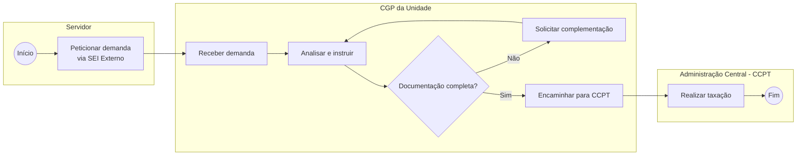

<pre>
 

```mermaid
flowchart LR

    %% Pool Servidor
    subgraph Servidor
        A((Início))
        B[Peticionar demanda<br>via SEI Externo]
    end

    %% Pool CGP
    subgraph CGP da Unidade
        C[Receber demanda]
        D[Analisar e instruir]
        E{Documentação completa?}
        F[Solicitar complementação]
        G[Encaminhar para CCPT]
    end

    %% Pool CCPT
    subgraph Administração Central - CCPT
        H[Realizar taxação]
        I((Fim))
    end

    A --> B
    B --> C
    C --> D
    D --> E
    E -- Não --> F
    F --> D
    E -- Sim --> G
    G --> H
    H --> I
```

</pre>
